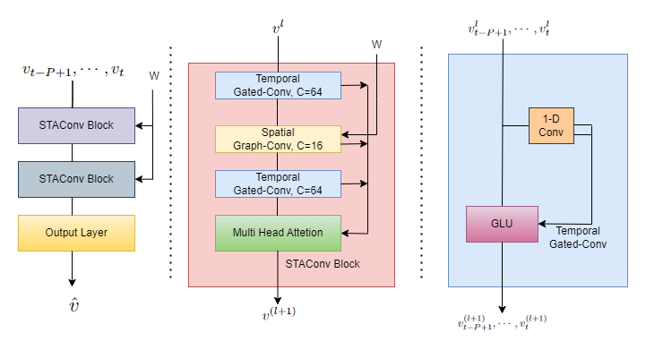

# Spatio-Temporal Attention Based Graph Convolutional Networks

## About

The PyTorch version of STAGCN implemented for the paper _STAGCN: Spatial-Temporal Attention Based Graph Convolutional Networks for COVID-19 Forecastingg_.

## Paper

[Paper @ OpenReview](<https://openreview.net/forum?id=k0E_VMXLXl&referrer=%5BAuthor%20Console%5D(%2Fgroup%3Fid%3DICLR.cc%2F2023%2FWorkshop%2FMLGH%2FAuthors%23your-submissions)>)

## Related works

1. TCN: [_An Empirical Evaluation of Generic Convolutional and Recurrent Networks for Sequence Modeling_](https://arxiv.org/abs/1803.01271)
2. GLU and GTU: [_Language Modeling with Gated Convolutional Networks_](https://arxiv.org/abs/1612.08083)
3. ChebNet: [_Convolutional Neural Networks on Graphs with Fast Localized Spectral Filtering_](https://arxiv.org/abs/1606.09375)
4. GCN: [_Semi-Supervised Classification with Graph Convolutional Networks_](https://arxiv.org/abs/1609.02907)
5. STAGCN: [_Spatio-Temporal Graph Convolutional Networks: A Deep Learning Framework for Traffic Forecasting_](https://arxiv.org/abs/1709.04875)

## Related code

1. TCN: https://github.com/locuslab/TCN
2. ChebNet: https://github.com/mdeff/cnn_graph
3. GCN: https://github.com/tkipf/pygcn
4. STGCN: https://github.com/hazdzz/STGCN

## Dataset

### Source

1. METR-LA: [DCRNN author's Google Drive](https://drive.google.com/file/d/1pAGRfzMx6K9WWsfDcD1NMbIif0T0saFC/view?usp=sharing)
2. PEMS-BAY: [DCRNN author's Google Drive](https://drive.google.com/file/d/1wD-mHlqAb2mtHOe_68fZvDh1LpDegMMq/view?usp=sharing)
3. PeMSD7(M): [STGCN author's GitHub repository](https://github.com/VeritasYin/STGCN_IJCAI-18/blob/master/data_loader/PeMS-M.zip)
4. Covid: https://covid19.who.int/

### Preprocessing

Using the formula from [ChebNet](https://arxiv.org/abs/1606.09375)：


## Model structure



## Differents of code between mine and author's

1. Fix bugs
2. Add Early Stopping approach
3. Add Dropout approach
4. Offer a different set of hyperparameters
5. Offer config files for two different categories graph convolution (ChebyGraphConv and GraphConv)
6. Add datasets METR-LA and PEMS-BAY
7. Adopt a different data preprocessing method
8. **Added the attention module**

## Requirements

To install requirements:

```console
pip3 install -r requirements.txt
```
